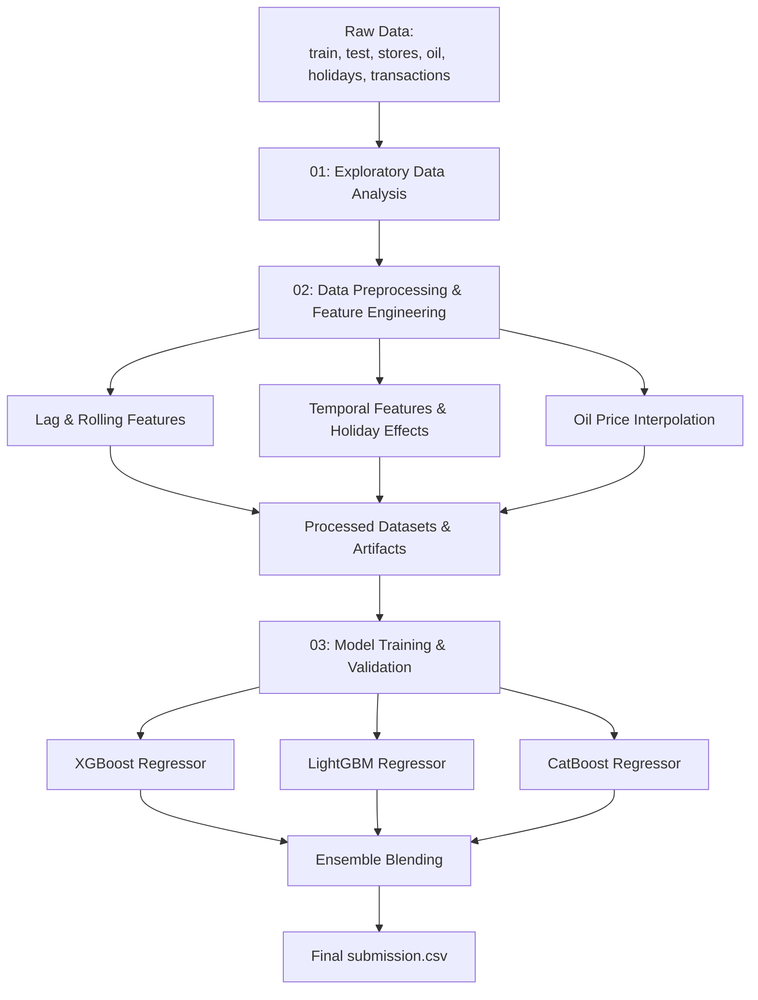

# 🛒 Store Sales - Time Series Forecasting

[](https://www.kaggle.com/competitions/store-sales-time-series-forecasting)
[](https://www.python.org/)
[](https://jupyter.org/)
[](https://github.com/luciuswilbert/store-sales-forecasting)

This repository contains an end-to-end machine learning pipeline to tackle the **Kaggle Store Sales - Time Series Forecasting** competition. The objective is to build a high-performance forecasting model that accurately predicts the unit sales for thousands of items sold at different **Corporación Favorita** stores (a large Ecuadorian-based grocery retailer).

---

## 📖 Context & Impact

Forecasts are highly relevant to brick-and-mortar grocery stores, which must dance delicately with how much inventory to buy:
* **Overestimating demand** leads to overstocked, perishable goods going to waste, causing financial loss and higher food waste.
* **Underestimating demand** leads to popular items selling out quickly, resulting in lost revenue and disappointed customers.

Using modern machine learning and historical time-series data, this project aims to automate and optimize product demand forecasts, helping grocery stores keep just enough of the right products at the right time.

---

## 🛠️ Project Pipeline Architecture

The workflow consists of three main phases, designed to move seamlessly from raw data analysis to ensemble model training:



---

## 📂 Notebooks & Workflow

All development is structured inside the [notebooks/](file:///c:/Users/Lucius/Documents/Project/Store%20Sales%20-%20Time%20Series%20Forecasting/store-sales-forecasting/notebooks) directory:

### 📊 [01-eda-store-sales.ipynb](file:///c:/Users/Lucius/Documents/Project/Store%20Sales%20-%20Time%20Series%20Forecasting/store-sales-forecasting/notebooks/01-eda-store-sales.ipynb)
Comprehensive exploratory data analysis focused on understanding relationships across several relational datasets:
* **Sales & Transactions Trends:** Analyzed volume and seasonal patterns.
* **Store Metadata:** Studied geographic clusters and store types.
* **Exogenous Variables:** Investigated oil price volatility (Ecuador's key economic driver) and local/national holidays.

### ⚙️ [02-data-preprocessing.ipynb](file:///c:/Users/Lucius/Documents/Project/Store%20Sales%20-%20Time%20Series%20Forecasting/store-sales-forecasting/notebooks/02-data-preprocessing.ipynb)
Data cleaning, feature engineering, and preparation of training/validation/testing artifacts:
* **Temporal Features:** Year, month, day of week, day of month, and weekend indicators.
* **Lags & Rolling Windows:** Derived lag features and rolling statistical aggregates (mean, std) for product sales.
* **Oil Price Handling:** Handled missing oil values through interpolation to keep a continuous economic indicator.
* **Holiday Mapping:** Aligned transfer holidays and local vs. national events with specific stores.

### 🤖 [03-model-training.ipynb](file:///c:/Users/Lucius/Documents/Project/Store%20Sales%20-%20Time%20Series%20Forecasting/store-sales-forecasting/notebooks/03-model-training.ipynb)
Model building, validation, and ensembling:
* Trained three state-of-the-art gradient boosted decision tree (GBDT) frameworks: **XGBoost**, **LightGBM**, and **CatBoost**.
* Implemented cross-validation tailored for time-series splits to prevent data leakage.
* Ensembled the models using optimal blending weights to generate robust, generalized predictions.

---

## 📈 Evaluation & Results

The performance metric for this competition is **Root Mean Squared Logarithmic Error (RMSLE)**, calculated as:

$$\text{RMSLE} = \sqrt{\frac{1}{n} \sum_{i=1}^{n} (\log(p_i + 1) - \log(a_i + 1))^2}$$

Where:
* $n$ is the total number of observations in the test set.
* $p_i$ is the predicted sales for instance $i$.
* $a_i$ is the actual sales for instance $i$.
* $\log$ represents the natural logarithm.

### Model Performance Summary

| Model / Approach | Validation RMSLE | Status |
| :--- | :---: | :---: |
| **XGBoost** (Single Best Model) | **0.5869** | Stable |
| **Ensemble Blend** (Multi-GBDT) | **0.5881** | Stable |

---

## 🚀 Getting Started

Follow these steps to set up and run this project locally:

### 1. Clone the Repository
```bash
git clone https://github.com/luciuswilbert/store-sales-forecasting.git
cd store-sales-forecasting
```

### 2. Set Up the Environment
Create a virtual environment and install the required dependencies (pandas, numpy, scikit-learn, xgboost, lightgbm, catboost, matplotlib, seaborn, etc.):
```bash
python -m venv venv
source venv/bin/activate  # On Windows, use: venv\Scripts\activate
pip install -r requirements.txt
```

### 3. Run the Notebooks
Execute the notebooks in sequence to reproduce results:
1. Run `notebooks/01-eda-store-sales.ipynb` to explore the data.
2. Run `notebooks/02-data-preprocessing.ipynb` to engineer features and output processed artifacts.
3. Run `notebooks/03-model-training.ipynb` to train models, evaluate validation metrics, and export the final submission.

---

## 📝 Submission Format

The final predictions are exported in the required format to `submission.csv` with the following structure:

```csv
id,sales
3000888,0.0
3000889,0.0
3000890,0.0
...
```

---

## 🎓 Citation

```bibtex
@misc{cook2021storesales,
  author    = {Alexis Cook and DanB and inversion and Ryan Holbrook},
  title     = {Store Sales - Time Series Forecasting},
  publisher = {Kaggle},
  year      = {2021},
  url       = {https://kaggle.com/competitions/store-sales-time-series-forecasting}
}
```
